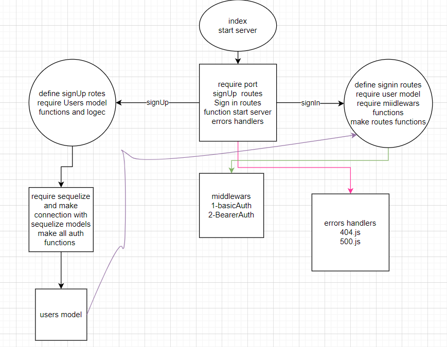

# auth-server
## server features:
> - `/` (`get ,ethod`): to show home page (`localhost:3000/`).
> - `/signup` (`post method`) : to enter a new user with username and password (`localhost:3000/signup`).
> - `/signin` (`post method`) : to log in with samse name and password and show user data  (`localhost:3000/signin`).
> - `/users` (`get method`) : to show user data by the tokin from login (`localhost:3000/users`).
> - `/secret` (`get method`) : to go to the secrt area by the tokin (`localhost:3000/secret`).
## How to run server:
>### 1- by run in local:
>> - clone this repo to your local machine.
>> - cd to the repo.
>> - in terminal run `npm install` to install backage that used in this server `express , dotenv , jest , supertest , nodemon`
>> - after that run npm `index.js` ore use `nodemon`.
>> - there is multible way to see result of this server by browser or thunder client . 
>> - if u want to add feature to this server there is `test` by `jest` you can test features with it before add to main.
>> - if you see any issue with my server fork my repo with datals and solution if you have it.
>### 2- by use online app for this server by heroku 
>> - [saleh-basic-api-server](https://saleh-bearer-auth.herokuapp.com/)

# UML Diagram
# 

## About this server
> - this server untel now undr workinf and many features will be added soon.
> - the food and clothes method make in this server as glopal middle war same as logger.
> - this server contains `middleWar` way for write functions.
> - this server contain  `404 error , 500 eror` handler. 
> - this server has test for all methods you can test before use anytime :).\

# heroku link
> [saleh-basic-api-server](https://saleh-bearer-auth.herokuapp.com/)

# GitHub actions link
> - [actions link](https://github.com/Salehziad/bearer-auth/actionsa)

# The pull request link
> - [pull request](https://github.com/Salehziad/bearer-auth/pulls?q=is%3Apr+is%3Aclosed)